###  [](https://git.io/typing-svg)

<hr>

### Nice to meet you, I'm Anthony

- I'm currently learning React
- I'm currently finishing my Master of Data Science @ USyd
- Open to On-site (Sydney) and Remote positions
- 2022 Goals
- Become Full-Stack
- Start contributing to Open Source
- Launch one large project
- Learn Typescript
- Personal Portfolio - Coming Soon!

```diff
Be Humble, Stay Curious
```

<hr>

### Connect with me:

&nbsp;&nbsp;


<hr>

### Lanugage and Tools:

Web Dev:

&nbsp;&nbsp;
&nbsp;&nbsp;
&nbsp;&nbsp;
&nbsp;&nbsp;
&nbsp;&nbsp;
&nbsp;&nbsp;
&nbsp;&nbsp;
&nbsp;&nbsp;

Machine Learning | Data Science:

&nbsp;&nbsp;
&nbsp;&nbsp;
&nbsp;&nbsp;
&nbsp;&nbsp;
&nbsp;&nbsp;
&nbsp;&nbsp;
&nbsp;&nbsp;
&nbsp;&nbsp;
