### [](https://git.io/typing-svg)

<hr>

### Nice to meet you, I'm Anthony 

- :computer: I'm currently learning Java, Ruby and Linux OS.
- :books: I studied Master of Data Science @ University of Sydney
- :raised_hands: Currently SDE I @ AWS
- :saxophone: I listen to Cafe Jazz when I code

```diff
Be Humble, Stay Curious
```

#### 2023 Goals

- :muscle: Get better at software designs
- :rocket: Start contributing to Open Source
- :zap: Write cleaner code
- :construction: Personal Portfolio - Coming Soon!

<hr>

### Connect with me:

[](https://www.linkedin.com/in/anthony-w-230452a2/)&nbsp;&nbsp;
[](https://twitter.com/anthonydwan)

<hr>

### Lanugage and Tools:

Web Development:

&nbsp;&nbsp;
&nbsp;&nbsp;
&nbsp;&nbsp;
&nbsp;&nbsp;
&nbsp;&nbsp;
&nbsp;&nbsp;
&nbsp;&nbsp;
&nbsp;&nbsp;
&nbsp;&nbsp;

Machine Learning | Data Science:

&nbsp;&nbsp;
&nbsp;&nbsp;
&nbsp;&nbsp;
&nbsp;&nbsp;
&nbsp;&nbsp;
&nbsp;&nbsp;
&nbsp;&nbsp;
&nbsp;&nbsp;
&nbsp;&nbsp;

<hr>

<br>[](https://github.com/anuraghazra/github-readme-stats)

[](https://github.com/anuraghazra/github-readme-stats)

[](https://open.spotify.com/user/anthonydwan)
